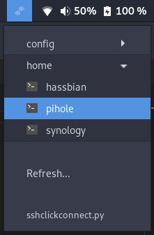

# sshclickconnect
Connect to your servers via gnome shell extension using [Argos](https://github.com/p-e-w/argos)

---
> :warning: **The script assumes [terminator](https://gnome-terminator.org/) is installed and executable via `terminator` command!**
---

This script produces a list of all servers inside the SSH config files.
It also searches for any `Include` lines inside your `~/.ssh/config` file and group the servers based on the config file they are in.

## Installation
run `setup.sh`
