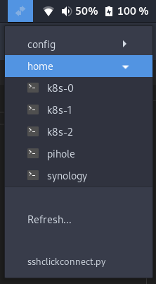

# sshclickconnect

## :speech_balloon: Description
Connect to your servers via gnome shell extension using [Argos](https://github.com/p-e-w/argos)

This script produces a list of all servers inside the SSH config files.
It also searches for any `Include` lines inside your ssh config file and groups the servers based on the config file they are in.



---
## :warning: Important notes! ##

If you do not have [terminator](https://gnome-terminator.org/) installed, make sure to adjust the content of `default_ssh_command`.

If your ssh config file is not located at `~/.ssh/config`, make sure to also adjust `default_ssh_config_path`.

---
## :rocket: Installation
```
git clone https://github.com/nliakm/sshclickconnect.git
cd sshclickconnect
./setup.sh
```


